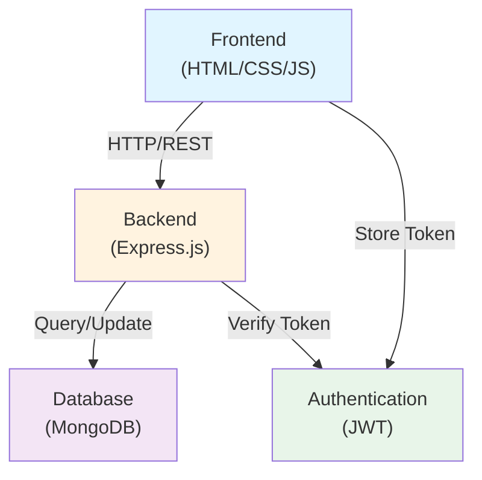
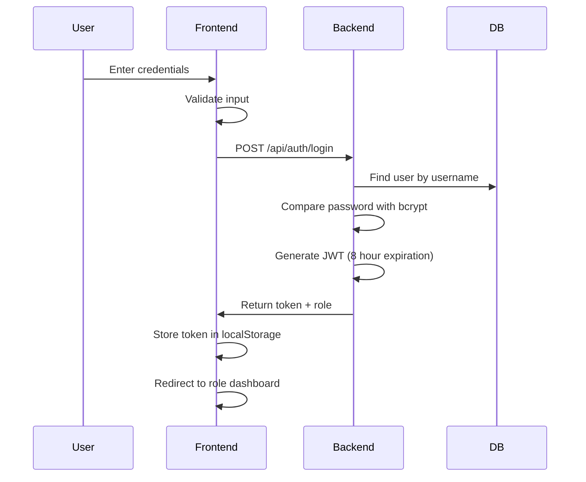
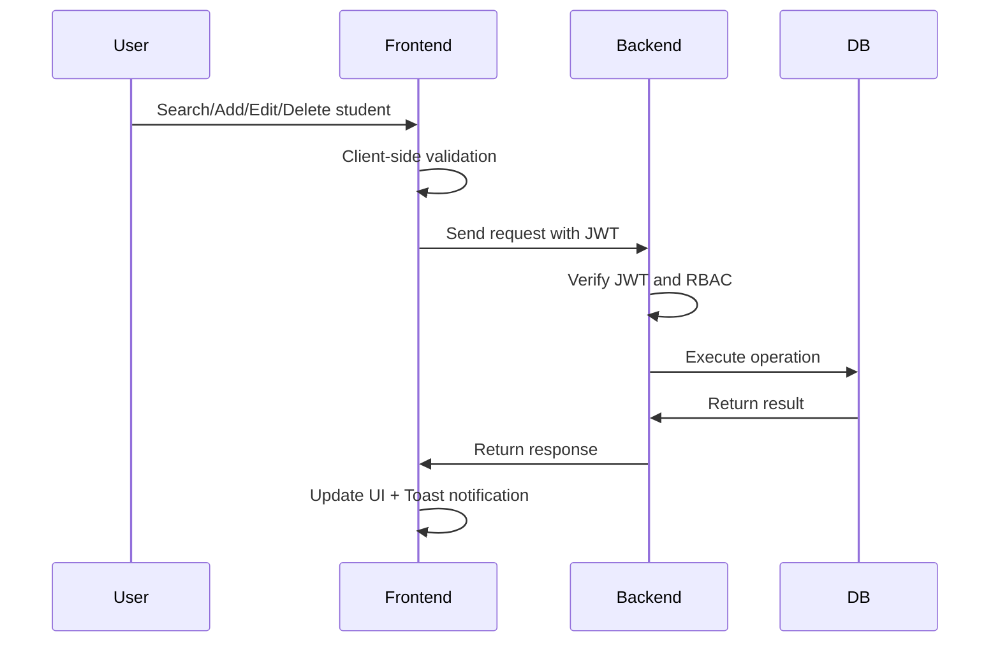
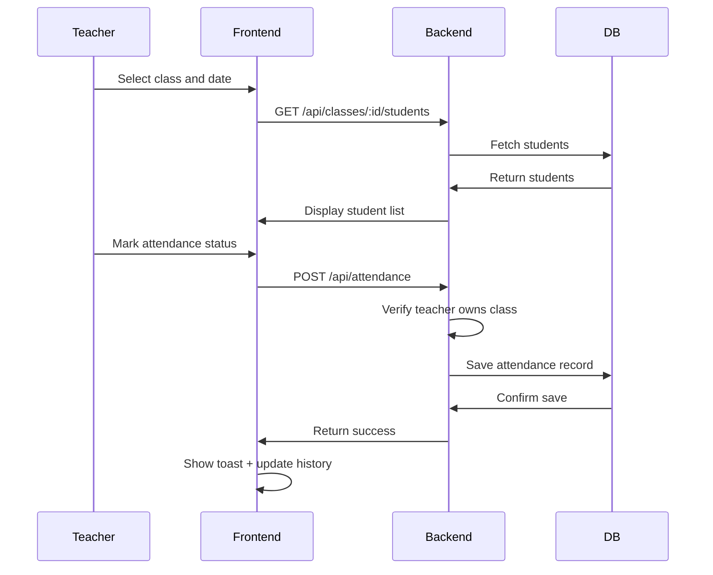

# Design Document: English Center Management System

## Overview

The English Center Management System is a comprehensive web-based platform designed to streamline all operational aspects of an English language training center. The system manages student profiles, class scheduling, attendance tracking, tuition payments, and provides analytics dashboards. It implements role-based access control (RBAC) with four distinct user roles: Admin, Teacher, Receptionist, and Accountant. Each role has specific permissions and views tailored to their responsibilities.

## Architecture

### System Architecture Diagram



### Technology Stack

**Frontend:**
- HTML5, CSS3, JavaScript (Vanilla)
- Responsive design (768px+ support)
- Toast notifications for user feedback
- Loading spinners for async operations

**Backend:**
- Node.js with Express.js
- JWT for stateless authentication
- bcrypt for password hashing (cost factor ≥ 10)
- CORS enabled for cross-origin requests

**Database:**
- MongoDB for data persistence
- Mongoose ODM for schema validation

**Security:**
- JWT tokens with 8-hour expiration
- Password hashing with bcrypt
- RBAC implementation
- Account lockout after 5 failed login attempts (15 minutes)
- Input validation on both client and server

## Components and Interfaces

### Backend Components

#### Authentication Module (`src/middleware/auth.js`)
- **Purpose**: JWT token verification and user authentication
- **Interface**:
  - `verifyToken(token)`: Validates JWT and returns decoded user data
  - `generateToken(user)`: Creates JWT with 8-hour expiration
- **Dependencies**: jsonwebtoken, User model

#### RBAC Module (`src/middleware/rbac.js`)
- **Purpose**: Role-based access control enforcement
- **Interface**:
  - `checkPermission(role, resource, action)`: Validates if role can perform action on resource
  - `requireRole(allowedRoles)`: Express middleware for route protection
- **Dependencies**: Authentication module

#### Controllers
- **authController.js**: Handles login, logout, token verification
  - `login(req, res)`: Authenticates user and returns JWT
  - `logout(req, res)`: Invalidates session
  - `verify(req, res)`: Validates JWT token
- **studentController.js**: CRUD operations for students
  - `getStudents(req, res)`: Paginated list with search
  - `createStudent(req, res)`: Add new student
  - `updateStudent(req, res)`: Update student info
  - `deleteStudent(req, res)`: Remove student (Admin only)
- **classController.js**: Class management operations
- **attendanceController.js**: Attendance recording and history
- **tuitionController.js**: Tuition tracking and updates
- **userController.js**: User account management (Admin only)

#### Models (Mongoose Schemas)
- **User**: Authentication and authorization data
- **Student**: Student profile information
- **Class**: Class details and scheduling
- **Attendance**: Attendance records
- **Tuition**: Payment tracking
- **LoginHistory**: Audit trail for logins

#### Database Layer (`src/config/database.js`)
- **Purpose**: MongoDB connection management
- **Interface**:
  - `connect()`: Establishes database connection with retry logic
  - `disconnect()`: Closes database connection
- **Configuration**: Connection string from environment variables

### Frontend Components

#### Authentication Components
- **Login Form** (`public/pages/login.html`, `public/js/login.js`)
  - Input validation
  - JWT storage in localStorage
  - Error message display
  - Redirect to role-specific dashboard

#### Layout Components
- **Header/Navigation** (included in all pages)
  - User profile display
  - Logout button
  - Responsive hamburger menu
- **Sidebar Navigation** (role-based menu rendering)
  - Dynamic menu items based on user role
  - Active state indicator
- **Footer** (copyright and support info)

#### Page Components
- **Dashboard Pages** (role-specific)
  - Admin: Metrics cards, enrollment chart, quick actions
  - Teacher: Class list, weekly schedule
  - Receptionist: Recent enrollments
  - Accountant: Tuition summary
- **Student Management** (`public/pages/students.html`, `public/js/students.js`)
  - Search with debounce (500ms)
  - Paginated table
  - Add/Edit/Delete modals
  - Form validation
- **Class Management** (`public/pages/classes.html`, `public/js/classes.js`)
  - Class list with search
  - Add/Edit/Delete modals (Admin only)
  - Student list modal
- **Attendance** (`public/pages/attendance.html`, `public/js/attendance.js`)
  - Class selector (filtered by teacher)
  - Date picker
  - Student status checkboxes
  - Attendance history
- **Tuition Management** (`public/pages/tuition.html`, `public/js/tuition.js`)
  - Search and filter
  - Payment update modal
  - Summary cards
- **User Management** (`public/pages/users.html`, `public/js/users.js`)
  - User list (Admin only)
  - Add/Edit user modals
  - Login history view

#### Shared UI Components
- **Toast Notification** (success/error/warning)
  - Auto-dismiss after 3 seconds
  - Position: top-right
- **Loading Spinner** (shown when loading > 200ms)
- **Confirmation Dialog** (for delete operations)
- **Pagination Controls** (previous/next, page numbers)

### API Interface Contracts

#### Request/Response Format
All API endpoints follow REST conventions:
- **Success Response**: `{ success: true, data: {...}, message: "..." }`
- **Error Response**: `{ success: false, error: "...", details: {...} }`
- **Authentication**: `Authorization: Bearer {JWT}` header required for protected routes

#### Data Validation
- **Client-side**: Immediate feedback for UX
- **Server-side**: Security enforcement with detailed error messages
- **Validation Rules**: Defined in Mongoose schemas and controller logic

### Component Communication

#### Frontend to Backend
- HTTP/REST API calls using fetch()
- JWT token in Authorization header
- JSON request/response bodies
- Error handling with try-catch and status code checks

#### Backend Internal
- Controllers call Models for data operations
- Middleware chain: Authentication → RBAC → Controller
- Models interact with MongoDB via Mongoose ODM

#### State Management
- JWT stored in localStorage
- User role and permissions cached in memory after login
- No global state management library (vanilla JS)

## Data Models

### User Schema

```javascript
{
  _id: ObjectId,
  tenDangNhap: String (required, max 50, unique, alphanumeric + underscore),
  matKhau: String (required, hashed with bcrypt, min 8, max 72),
  hoTen: String (required, max 100),
  vaiTro: Enum (Admin, Giao_Vien, Le_Tan, Ke_Toan),
  trangThai: Enum (Hoat_Dong, Vo_Hieu),
  ngayTao: Date (default: now),
  ngayCapNhat: Date,
  soLanDangNhapSai: Number (default: 0),
  thoiGianKhoaTaiKhoan: Date (null if not locked)
}
```

### Student Schema

```javascript
{
  _id: ObjectId,
  hoTen: String (required, max 100),
  ngaySinh: Date,
  gioiTinh: Enum (Nam, Nu, Khac),
  soDienThoai: String (required, 10 digits, Vietnamese format),
  email: String (optional, valid email format),
  diaChi: String,
  ngayNhapHoc: Date (required),
  lopHoc: ObjectId (reference to Class, required),
  trangThai: Enum (Dang_Hoc, Bao_Luu, Da_Nghi, Hoan_Thanh),
  ngayTao: Date (default: now),
  ngayCapNhat: Date
}
```

### Class Schema

```javascript
{
  _id: ObjectId,
  maLop: String (required, unique, format: [LOAI]-[4 digits]),
  tenLop: String (required, max 100),
  loaiKhoaHoc: Enum (IELTS, TOEIC, Giao_Tiep),
  giaoVien: ObjectId (reference to User),
  lichHoc: {
    ngayTrongTuan: Array (Mon, Tue, Wed, Thu, Fri, Sat, Sun),
    gioBatDau: String (HH:mm format),
    gioKetThuc: String (HH:mm format)
  },
  siSoToiDa: Number (1-100),
  siSoHienTai: Number (default: 0),
  trangThai: Enum (Dang_Mo, Da_Ket_Thuc, Tam_Dung),
  ngayTao: Date (default: now),
  ngayCapNhat: Date
}
```

### Attendance Schema

```javascript
{
  _id: ObjectId,
  lopHoc: ObjectId (reference to Class, required),
  ngayDiemDanh: Date (required),
  bangDiemDanh: [
    {
      hocVien: ObjectId (reference to Student),
      trangThai: Enum (Co_Mat, Vang_Co_Phep, Vang_Khong_Phep)
    }
  ],
  giaoVien: ObjectId (reference to User),
  ngayTao: Date (default: now),
  ngayCapNhat: Date
}
```

### Tuition Schema

```javascript
{
  _id: ObjectId,
  hocVien: ObjectId (reference to Student, required),
  lopHoc: ObjectId (reference to Class, required),
  tongSoTienPhaiDong: Number (required),
  soTienDaDong: Number (default: 0),
  kyDong: String (YYYY-MM format),
  ngayDenHan: Date,
  ngayDongThucTe: Date,
  trangThai: Enum (Da_Dong, Dong_Mot_Phan, Chua_Dong) (calculated),
  nguoiCapNhat: ObjectId (reference to User),
  ngayTao: Date (default: now),
  ngayCapNhat: Date
}
```

### Login History Schema

```javascript
{
  _id: ObjectId,
  tenDangNhap: String,
  thoiGianDangNhap: Date (default: now),
  diaChiIP: String,
  trangThaiDangNhap: Enum (Thanh_Cong, That_Bai)
}
```

## API Endpoints

### Authentication Endpoints

**POST /api/auth/login**
- Request: `{ tenDangNhap, matKhau }`
- Response: `{ token, vaiTro, hoTen, tenDangNhap }`
- Status: 200 (success), 401 (invalid credentials), 429 (account locked)

**POST /api/auth/logout**
- Request: `{ token }`
- Response: `{ message: "Đăng xuất thành công" }`
- Status: 200

**GET /api/auth/verify**
- Request: Header `Authorization: Bearer {token}`
- Response: `{ valid: boolean, vaiTro: string }`
- Status: 200, 401 (invalid token)

### Student Management Endpoints

**GET /api/students**
- Query params: `page=1&limit=20&search=keyword`
- Response: `{ data: [students], total: number, page: number, pages: number }`
- Status: 200
- Permissions: Admin, Le_Tan, Giao_Vien (own class only)

**POST /api/students**
- Request: Student object with validation
- Response: `{ message, data: student }`
- Status: 201 (created), 400 (validation error)
- Permissions: Admin, Le_Tan

**PUT /api/students/:id**
- Request: Updated student fields
- Response: `{ message, data: student }`
- Status: 200, 400 (validation error)
- Permissions: Admin, Le_Tan

**DELETE /api/students/:id**
- Response: `{ message: "Xóa thành công" }`
- Status: 200, 404 (not found)
- Permissions: Admin only

### Class Management Endpoints

**GET /api/classes**
- Query params: `page=1&limit=20&search=keyword`
- Response: `{ data: [classes], total: number }`
- Status: 200
- Permissions: Admin, Le_Tan, Giao_Vien

**POST /api/classes**
- Request: Class object with auto-generated maLop
- Response: `{ message, data: class }`
- Status: 201, 400 (validation error)
- Permissions: Admin only

**PUT /api/classes/:id**
- Request: Updated class fields
- Response: `{ message, data: class }`
- Status: 200, 400 (validation error)
- Permissions: Admin only

**DELETE /api/classes/:id**
- Response: `{ message: "Xóa lớp học thành công" }`
- Status: 200, 400 (class has active students), 404
- Permissions: Admin only

**GET /api/classes/:id/students**
- Response: `{ data: [students with status] }`
- Status: 200
- Permissions: Admin, Le_Tan, Giao_Vien (own class only)

### Attendance Endpoints

**GET /api/attendance/classes/:classId**
- Query params: `page=1&limit=20`
- Response: `{ data: [attendance records] }`
- Status: 200
- Permissions: Giao_Vien (own class only), Admin

**POST /api/attendance**
- Request: `{ lopHoc, ngayDiemDanh, bangDiemDanh: [{hocVien, trangThai}] }`
- Response: `{ message, data: attendance }`
- Status: 201, 400 (validation error), 403 (unauthorized class)
- Permissions: Giao_Vien (own class only), Admin

**PUT /api/attendance/:id**
- Request: Updated attendance data
- Response: `{ message, data: attendance }`
- Status: 200, 403 (unauthorized)
- Permissions: Giao_Vien (own class only), Admin

**GET /api/attendance/student/:studentId/history**
- Response: `{ data: [attendance records with attendance rate] }`
- Status: 200
- Permissions: Giao_Vien, Admin, Ke_Toan

### Tuition Endpoints

**GET /api/tuition**
- Query params: `page=1&limit=20&status=&classId=&search=`
- Response: `{ data: [tuition records], total: number }`
- Status: 200
- Permissions: Ke_Toan, Admin

**PUT /api/tuition/:id**
- Request: `{ soTienDaDong }`
- Response: `{ message, data: tuition }`
- Status: 200, 400 (amount exceeds total)
- Permissions: Ke_Toan, Admin

**GET /api/tuition/summary**
- Response: `{ unpaidCount, partialCount, totalRevenueThisMonth }`
- Status: 200
- Permissions: Ke_Toan, Admin

### User Management Endpoints

**GET /api/users**
- Query params: `page=1&limit=20`
- Response: `{ data: [users], total: number }`
- Status: 200
- Permissions: Admin only

**POST /api/users**
- Request: `{ tenDangNhap, matKhau, hoTen, vaiTro }`
- Response: `{ message, data: user }`
- Status: 201, 400 (validation error), 409 (username exists)
- Permissions: Admin only

**PUT /api/users/:id**
- Request: `{ hoTen, vaiTro, trangThai }`
- Response: `{ message, data: user }`
- Status: 200, 400 (validation error)
- Permissions: Admin only

**GET /api/users/login-history**
- Query params: `page=1&limit=50`
- Response: `{ data: [login records] }`
- Status: 200
- Permissions: Admin only

### Dashboard Endpoints

**GET /api/dashboard/admin**
- Response: `{ tongHocVienDangHoc, tongLopDangMo, hocPhiChuaDong, doanhThuThangNay }`
- Status: 200
- Permissions: Admin only

**GET /api/dashboard/teacher**
- Response: `{ lopDangPhutRoi: [classes], lichDayTuanNay: [schedule] }`
- Status: 200
- Permissions: Giao_Vien

**GET /api/dashboard/receptionist**
- Response: `{ hocVienNhapHocGanDay: [students] }`
- Status: 200
- Permissions: Le_Tan

**GET /api/dashboard/accountant**
- Response: `{ hocPhiChuaDong, hocPhiDongMotPhan, doanhThuThangNay }`
- Status: 200
- Permissions: Ke_Toan

## Frontend Components

### Layout Components

**Header/Navigation**
- Logo and branding
- User profile dropdown (name, role)
- Logout button
- Responsive hamburger menu for mobile

**Sidebar Navigation**
- Dynamic menu based on user role
- Menu items: Dashboard, Student Management, Class Management, Attendance, Tuition, User Management (Admin only)
- Active state indicator
- Collapsible on mobile

**Footer**
- Copyright information
- Support contact

### Page Components

**Login Page**
- Username input (max 50 chars)
- Password input
- Login button (disabled when fields empty)
- Error message display
- Responsive design

**Dashboard Pages (Role-specific)**
- Admin: 4 metric cards, enrollment chart (12 months), quick actions
- Teacher: Class list, weekly schedule, attendance quick access
- Receptionist: Recent student enrollments, quick add student
- Accountant: Tuition summary, overdue alerts, monthly revenue

**Student Management Page**
- Search bar with real-time filtering (500ms debounce)
- Paginated table (20 per page)
- Add/Edit/Delete buttons (Delete hidden for Le_Tan)
- Modal forms for add/edit with inline validation
- Confirmation dialog for delete
- Toast notifications for actions

**Class Management Page**
- Search bar for class name/code
- Paginated table with class details
- "Full" badge for classes at capacity
- Add/Edit/Delete buttons (Admin only)
- Modal forms with validation
- Student list modal for each class

**Attendance Page**
- Class selector (only teacher's classes)
- Date picker for attendance date
- Student list with status checkboxes (Present/Absent with permission/Absent without permission)
- Attendance history with attendance rate calculation
- Edit capability for past records

**Tuition Management Page**
- Search and filter (status, class)
- Paginated table with tuition details
- Overdue warning badges (red, >30 days overdue)
- Edit modal for payment amount
- Summary cards (unpaid count, partial count, monthly revenue)

**User Management Page (Admin only)**
- User list with role and status
- Add user button
- Edit/Disable buttons
- Login history view
- Modal forms with password validation

### Shared Components

**Toast Notification**
- Auto-dismiss after 3 seconds
- Success/Error/Warning variants
- Position: top-right

**Loading Spinner**
- Shown when data loading > 200ms
- Centered in content area

**Confirmation Dialog**
- Title, message, confirm/cancel buttons
- Used for delete operations

**Pagination**
- Previous/Next buttons
- Page number display
- Jump to page input

## Data Flow

### Authentication Flow



### Student Management Flow



### Attendance Recording Flow



## Security Considerations

### Authentication & Authorization

- JWT tokens stored in localStorage with 8-hour expiration
- Password hashing with bcrypt (cost factor ≥ 10)
- Account lockout after 5 failed login attempts (15 minutes)
- RBAC enforced on both frontend (UI) and backend (API)
- Protected routes redirect to login if no valid JWT

### Data Protection

- All passwords hashed before storage
- No plaintext passwords in logs or responses
- Sensitive error messages don't reveal which field failed
- HTTP 403 responses don't reveal resource details

### Input Validation

- Client-side validation for UX feedback
- Server-side validation for security
- Phone number format validation (10 digits, Vietnamese)
- Email format validation
- Username alphanumeric + underscore only
- Password complexity requirements (8-72 chars, uppercase, lowercase, digit)

### API Security

- CORS enabled for frontend domain only
- JWT verification on protected endpoints
- RBAC checks before data access
- Rate limiting on login endpoint (prevent brute force)
- Login history tracking for audit

## Performance Considerations

### Frontend Performance

- Lazy loading for large lists (pagination)
- Debounced search (500ms)
- Loading spinners for async operations (>200ms)
- Responsive design (768px+ support)
- Minimal CSS/JS bundle size

### Backend Performance

- Database indexing on frequently queried fields (tenDangNhap, soDienThoai, maLop)
- Pagination for list endpoints (default 20 items)
- Query optimization with Mongoose lean() for read-only queries
- Connection pooling for MongoDB

### Database Performance

- Indexes on: tenDangNhap (unique), soDienThoai, maLop (unique), lopHoc (foreign key)
- Compound indexes for common filter combinations
- TTL index on login history (auto-delete after 90 days)

## Error Handling

### Client-Side Error Handling

- Form validation with inline error messages
- Network error messages in Vietnamese
- Graceful degradation for missing data
- Retry logic for failed requests

### Server-Side Error Handling

- Validation error responses with field-level details
- Generic error messages for security (don't reveal internals)
- Proper HTTP status codes (400, 401, 403, 404, 500)
- Error logging for debugging

### User-Facing Error Messages

- "Tên đăng nhập hoặc mật khẩu không đúng" (login failure)
- "Tài khoản bị khóa tạm thời, vui lòng thử lại sau 15 phút" (lockout)
- "Bạn không có quyền thực hiện thao tác này" (authorization failure)
- "Không thể kết nối đến máy chủ. Vui lòng thử lại sau." (network error)

## Testing Strategy

### Property-Based Testing Assessment

**Property-based testing (PBT) is NOT applicable to this feature** for the following reasons:

1. **Primary functionality is CRUD operations**: The system mainly performs Create, Read, Update, Delete operations on students, classes, attendance, and tuition records. These operations don't have universal properties that benefit from randomized input testing.

2. **UI-heavy feature**: Significant portions of the requirements involve UI rendering, layout, responsive design, and user interactions (dashboards, forms, modals, toast notifications). PBT is not suitable for testing visual presentation and user experience.

3. **External service integration**: The system relies on MongoDB for persistence and JWT for authentication. Testing these integrations requires example-based integration tests rather than property-based tests.

4. **Configuration and setup validation**: Many requirements involve checking that the correct UI elements are shown/hidden based on user roles, which are configuration checks best tested with example-based tests.

5. **Deterministic business logic**: The business rules (e.g., attendance rate calculation, tuition status determination) are straightforward calculations that can be thoroughly tested with a small set of representative examples rather than 100+ randomized iterations.

**Alternative Testing Approach**: This feature will use **example-based unit tests** for business logic, **integration tests** for API endpoints with RBAC, and **end-to-end tests** for user workflows.

### Unit Testing

**Focus**: Specific examples and edge cases for business logic

- **Authentication**:
  - Valid credentials return JWT with correct expiration
  - Invalid credentials return appropriate error message
  - Password hashing with bcrypt (cost factor ≥ 10)
  - Account lockout after 5 failed attempts
  - Locked account prevents login for 15 minutes

- **RBAC Permission Checks**:
  - Admin has access to all resources
  - Le_Tan can view/add/edit students but not delete
  - Giao_Vien can only access own classes
  - Ke_Toan can view/update tuition records
  - Unauthorized access returns HTTP 403

- **Data Validation**:
  - Phone number format (10 digits, Vietnamese)
  - Email format validation
  - Username format (alphanumeric + underscore, max 50 chars)
  - Password complexity (8-72 chars, uppercase, lowercase, digit)
  - Required field validation

- **Business Logic Calculations**:
  - Attendance rate: (present count / total sessions) × 100%
  - Tuition status: Đã đóng (paid = total), Đóng một phần (0 < paid < total), Chưa đóng (paid = 0)
  - Class capacity check: siSoHienTai ≤ siSoToiDa
  - Overdue tuition detection (>30 days past due date)

- **Auto-generation Logic**:
  - Class code format: [LOAI]-[4 digits]
  - Unique code generation with collision handling

### Integration Testing

**Focus**: API endpoints with authentication, authorization, and database operations

- **Authentication Flow**:
  - POST /api/auth/login with valid credentials returns JWT
  - POST /api/auth/login with invalid credentials returns 401
  - POST /api/auth/login after 5 failed attempts returns 429 (locked)
  - GET /api/auth/verify with valid JWT returns user info
  - GET /api/auth/verify with expired JWT returns 401

- **Student Management**:
  - GET /api/students returns paginated list (Admin, Le_Tan, Giao_Vien)
  - POST /api/students creates student (Admin, Le_Tan only)
  - PUT /api/students/:id updates student (Admin, Le_Tan only)
  - DELETE /api/students/:id removes student (Admin only)
  - Search filters by name and phone number
  - Validation errors return 400 with field details

- **Class Management**:
  - GET /api/classes returns class list with filters
  - POST /api/classes creates class with auto-generated code (Admin only)
  - PUT /api/classes/:id updates class (Admin only)
  - DELETE /api/classes/:id fails if class has active students
  - GET /api/classes/:id/students returns student list

- **Attendance**:
  - POST /api/attendance creates attendance record (Giao_Vien for own class)
  - POST /api/attendance returns 403 for unauthorized class
  - GET /api/attendance/classes/:classId returns history
  - PUT /api/attendance/:id updates existing record
  - Attendance rate calculation is correct

- **Tuition**:
  - GET /api/tuition returns filtered list (Ke_Toan, Admin)
  - PUT /api/tuition/:id updates payment amount
  - PUT /api/tuition/:id rejects amount > total
  - GET /api/tuition/summary returns correct counts and revenue

- **User Management**:
  - POST /api/users creates user with hashed password (Admin only)
  - POST /api/users returns 409 if username exists
  - PUT /api/users/:id updates user info (Admin only)
  - Disabled user cannot login
  - Login history is recorded

### End-to-End Testing

**Focus**: Complete user workflows across frontend and backend

- **Login and Dashboard Access**:
  - User logs in and is redirected to role-specific dashboard
  - Admin sees 4 metric cards and enrollment chart
  - Teacher sees class list and weekly schedule
  - Receptionist sees recent enrollments
  - Accountant sees tuition summary

- **Student Management Workflow**:
  - Le_Tan searches for student by name
  - Le_Tan adds new student with valid data
  - Le_Tan edits student information
  - Admin deletes student (confirmation dialog appears)
  - Toast notifications appear for all actions

- **Class Creation and Enrollment**:
  - Admin creates new class with auto-generated code
  - Admin adds students to class
  - Class shows "Lớp đã đầy" when at capacity
  - Admin cannot reduce max capacity below current enrollment

- **Attendance Marking**:
  - Teacher selects own class
  - Teacher marks attendance for today's session
  - Attendance history shows correct attendance rate
  - Teacher edits past attendance record

- **Tuition Payment**:
  - Accountant filters tuition by status "Chưa đóng"
  - Accountant updates payment amount
  - Tuition status changes automatically
  - Overdue badge appears for >30 days overdue

### Browser Compatibility Testing

**Focus**: UI rendering and functionality across browsers

- Chrome (latest stable)
- Firefox (latest stable)
- Edge (latest stable)
- Responsive design on 768px+ screens
- No JavaScript console errors
- All buttons and links functional
- Tables have horizontal scroll when needed

## Deployment Considerations

### Environment Configuration

- Development: localhost:3000, MongoDB local
- Production: Environment variables for API URL, MongoDB connection string
- CORS configuration per environment

### Database Migrations

- Initial schema creation with indexes
- User seed data (default admin account)
- Sample class and student data for testing

### Monitoring & Logging

- Server error logging
- API request/response logging
- Database query performance monitoring
- User activity audit trail (login history)

